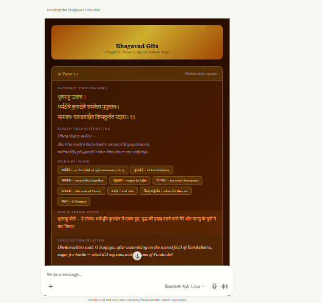

# ॐ Bhagavad Gita Skill — Claude AI

> *"Yoga is the journey of the self, through the self, to the self."* — Bhagavad Gita 6.20

A **deep, living knowledge skill** for Claude AI that transforms your conversations into an immersive, visually beautiful Bhagavad Gita study experience — complete with Sanskrit shlokas, word-by-word meanings, Hindi & English translations, and practical life guidance.

---

## 🌟 What This Skill Does

This skill turns Claude into a wise, compassionate Gita guru with three modes:

| Mode | When It Activates |
|------|-------------------|
| 🪔 **Guru Mode** | Life struggles, grief, confusion, fear, moral dilemmas |
| 📖 **Teacher Mode** | Chapter study, verse explanations, philosophical deep dives |
| 🤝 **Friend Mode** | Casual curiosity, concept exploration, spiritual discussion |

---

## 📸 Preview

> **Example: Reading Bhagavad Gita Chapter 1, Verse 1 inside Claude**



*The skill renders a beautiful, app-like widget directly inside Claude's chat — with Sanskrit (Devanagari), Roman transliteration, word-by-word breakdown, Hindi translation, English translation, deep explanation, and modern life application.*

---

## ✨ Features

### 🎨 Visual-First Experience
Every response renders as a **rich inline widget** with:
- **Gold Sanskrit text** (Devanagari)
- **Soft purple transliteration** (Roman)  
- **Word-by-word badges** with meanings
- **Warm orange Hindi** translation
- **Cream English** translation
- **Green deep explanation**
- **Blue modern life application**

### 📚 Full Coverage — All 18 Chapters, 700 Shlokas
| Chapter | Name | Theme |
|---------|------|-------|
| 1 | Arjuna Vishada Yoga | Arjuna's grief and moral crisis |
| 2 | Sankhya Yoga | Knowledge of the self; the immortal soul |
| 3 | Karma Yoga | Path of selfless action |
| 4 | Jnana Karma Sanyasa Yoga | Knowledge and renunciation |
| 5 | Karma Sanyasa Yoga | Renunciation of action |
| 6 | Dhyana Yoga | Meditation and self-control |
| 7 | Jnana Vijnana Yoga | Knowledge of the absolute |
| 8 | Aksara Brahma Yoga | The imperishable Brahman |
| 9 | Raja Vidya Raja Guhya Yoga | The royal secret |
| 10 | Vibhuti Yoga | Divine glories of God |
| 11 | Vishwarupa Darshana Yoga | The cosmic form |
| 12 | Bhakti Yoga | The path of devotion |
| 13 | Kshetra Kshetrajna Vibhaga Yoga | The field and the knower |
| 14 | Gunatraya Vibhaga Yoga | The three qualities |
| 15 | Purushottama Yoga | The supreme person |
| 16 | Daivasura Sampad Vibhaga Yoga | Divine and demonic natures |
| 17 | Shraddhatraya Vibhaga Yoga | The three types of faith |
| 18 | Moksha Sanyasa Yoga | Liberation through renunciation |

---

## 🔤 Key Shlokas Always Ready

| Verse | Topic | Opening Line |
|-------|-------|-------------|
| **2.47** | Nishkama Karma | कर्मण्येवाधिकारस्ते... |
| **2.20** | Immortal Soul | न जायते म्रियते वा... |
| **2.22** | Changing Bodies | वासांसि जीर्णानि यथा... |
| **9.22** | Krishna's Promise | अनन्याश्चिन्तयन्तो मां... |
| **18.66** | Surrender | सर्वधर्मान्परित्यज्य... |
| **2.62-63** | Chain of Destruction | ध्यायतो विषयान्पुंसः... |

---

## 🛠️ Installation

### Option 1: Manual Install (Claude.ai)
1. Download or clone this repository
2. Go to **Claude.ai** → **Settings** → **Skills**
3. Upload the `SKILL.md` file
4. The skill will auto-trigger on relevant conversations

### Option 2: Clone & Use
```bash
git clone https://github.com/YOUR_USERNAME/bhagavad-gita-skill.git
```
Then upload `SKILL.md` to your Claude skills directory.

---

## 💬 Trigger Phrases

This skill activates when you:

- Share a life problem, struggle, fear, grief, or confusion
- Ask *"What does the Gita say about [topic]?"*
- Ask for a specific shloka (e.g., *"Explain 2.47"*)
- Say keywords: **karma, dharma, moksha, yoga, atma, maya, bhakti**
- Ask *"What should I do?"* in a spiritual context
- Mention Krishna, Arjuna, Kurukshetra

---

## 🎯 Example Conversations

```
User: I'm feeling so lost and don't know my purpose in life.
→ Gita wisdom on dharma and karma yoga with relevant shlokas

User: Explain Bhagavad Gita Chapter 2
→ Full chapter overview with key verses and themes

User: What does verse 18.66 mean?
→ Full Sanskrit, transliteration, word-by-word, Hindi, English, deep explanation

User: How do I deal with anger?
→ Teaching from 2.62-63 with modern life application
```

---

## 🎨 Visual Design System

```
Background:     linear-gradient(135deg, #1a0a00, #2d1200)
Sanskrit:       #D4AF37 (gold)
Transliteration: #9B8DB0 (soft purple)  
Hindi:          #F4A460 (warm orange)
English:        #E8D5B7 (cream)
Explanation:    #C8E6C9 (soft green)
Application:    #B3E5FC (soft blue)
```

---

## 📂 Repository Structure

```
bhagavad-gita-skill/
├── SKILL.md        # The main skill file for Claude
├── README.md       # This file
└── example.PNG     # Screenshot of the skill in action
```

---

## 🤝 Contributing

Pull requests are welcome! You can:
- Add more shlokas to the "Key Shlokas" section
- Improve Hindi/English translations
- Add new life-guidance mappings
- Improve visual templates

---

## 📜 License

MIT License — free to use, share, and modify.

---

## 🙏 Acknowledgments

*Dedicated to all seekers of wisdom, and to the eternal teachings of the Bhagavad Gita that have guided humanity for thousands of years.*

> *"The soul is never born nor dies at any time."* — Bhagavad Gita 2.20

---

**Made with ❤️ for Claude AI Skills**
